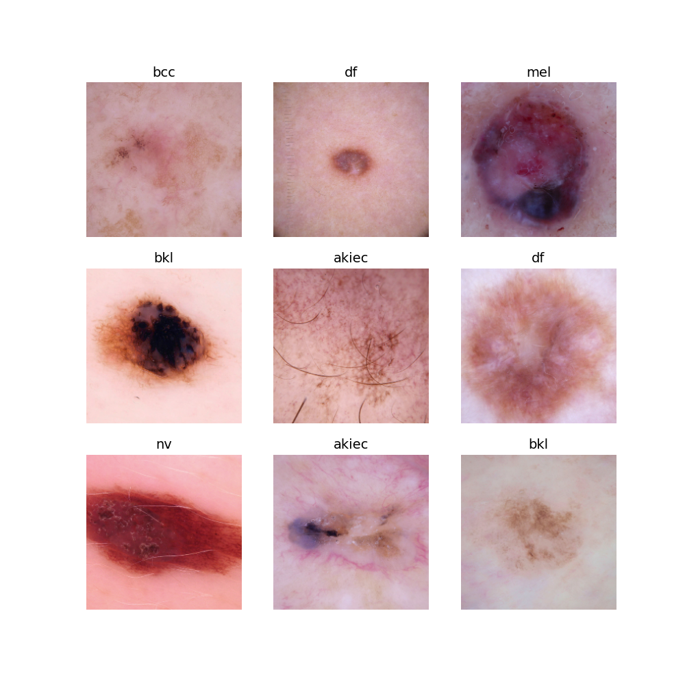

<h1 align="center">
  <a href="https://github.com/jpope8/skin-image-analysis">
    <!-- Please provide path to your logo here -->
    
  </a>
</h1>

<div align="center">
  Python code to analyse skin images (specifically moles/cancer).
  <br />
  <a href="#usage"><strong>Usage</strong></a> | <a href="#citing"><strong>Citing</strong></a>
  <br />
  <!--
  <br />
  <a href="https://github.com/jpope8/synergia-datadrift-dataset/issues/new?assignees=&labels=bug&template=01_BUG_REPORT.md&title=bug%3A+">Report a Bug</a>
  ·
  <a href="https://github.com/jpope8/synergia-datadrift-dataset/issues/new?assignees=&labels=enhancement&template=02_FEATURE_REQUEST.md&title=feat%3A+">Request a Feature</a>
  .
  <a href="https://github.com/jpope8/synergia-datadrift-dataset/issues/new?assignees=&labels=question&template=04_SUPPORT_QUESTION.md&title=support%3A+">Ask a Question</a>
  -->
</div>

<div align="center">
<br />

[](LICENSE)
[](https://github.com/jpope8/container-escape-analysis/issues?q=is%3Aissue+is%3Aopen+label%3A%22help+wanted%22)
[](https://github.com/jpope8)

</div>


## Contents

- [Introduction](#introduction)
- [Usage](#usage)
- [Citing](#citing)
- [License](#license)


---


## Introduction

This repository provides source code for evaluating tone bias in skin lesion images. The dataset images are a subset from the International Skin Imaging Collaboration (ISIC) Archive.

* Code to train machine learning models (convolutional neural networks) to determine the diagnosis ({benign,malignant}) given an input image.
* Code to analyse how well the diagnosis classification performs (traditional test set accuracy metrics).
* Code to analyse the tone bias of the trained model.

PyTorch is used as the deep learning framework to train/evaluate the models.  The original backend was MPS (Mac M2 Max series) but was also tested with CPU backend.

The hyper-parameter tuning used Optuna and was carried out on the Isambard-AI supercomputer in Bristol, UK, using the Open MPI backend.

## Installation

First create a virtual python environment.  The virtual environment only installs pip and python.

```bash
python3 -m venv skin-image-analysis
cd ./skin-image-analysis
source ./bin/activate
```

Clone the repository.

```bash
git clone git clone https://<git username>@github.com/jpope8/skin-image-analysis.git
(enter your git token)
```

Install dependencies via the requirements.txt file.

```bash
pip install -r requirements.txt 
```

This completes the installation.

## Dataset

The data was downloaded from the ISIC archive using the cli tool (need to install this first).

See https://pypi.org/project/isic-cli/

See https://github.com/ImageMarkup/isic-cli

```
mkdir tone

cd tone

isic image download --search 'fitzpatrick_skin_type:I OR fitzpatrick_skin_type:II OR fitzpatrick_skin_type:III OR fitzpatrick_skin_type:IV OR fitzpatrick_skin_type:V OR fitzpatrick_skin_type:VI' .
```


## Usage

These instructions assume you have installed common Python analysis libraries using the provided requirements.txt.  Python3 is assumed and required.


To train a new model, run the tone_bias_train module.

Usage: <root directory of ISIC images> <number of epochs for training> <'balance' or 'imbalanced' | path to existing model>")

```bash
cd skin-image-analysis
python python ./src/tone_bias_train.py tone 20 balance
```

This will take some time depending on your machine but should finish within an hour.  When finished, the model will be saved in the experiments folder.

Buena Suerte.


## References
> - [1] This work was supported by the Jean Golding Institute Staff Seed Corn Funding Call 2023-2024, "Pilot Study to determine Tone Bias in Open-Source Skin Cancer Datasets".

> - [2] @misc{pope2025skincancermachinelearning,
      title={Skin Cancer Machine Learning Model Tone Bias}, 
      author={James Pope and Md Hassanuzzaman and William Chapman and Huw Day and Mingmar Sherpa and Omar Emara and Nirmala Adhikari and Ayush Joshi},
      year={2025},
      eprint={2410.06385},
      archivePrefix={arXiv},
      primaryClass={eess.IV},
      url={https://arxiv.org/abs/2410.06385 }, 
}

## License

This project is licensed under the **MIT License**.

See [LICENSE](LICENSE) for more information.
